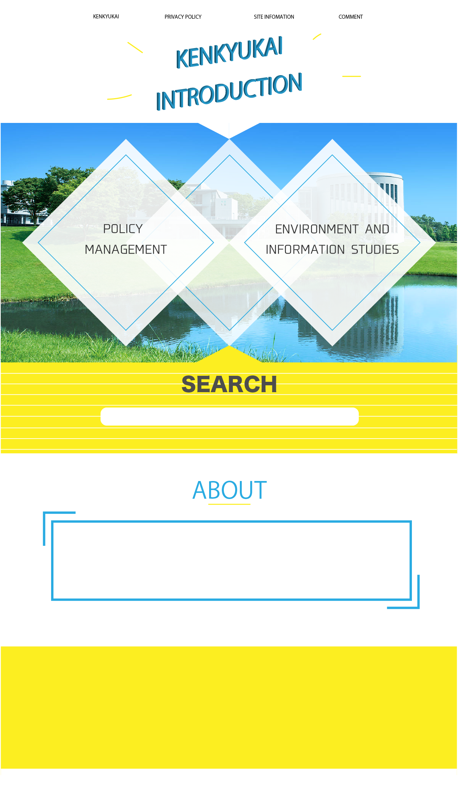

# WebDesign_Management
## 2019 Fall semester Web Design and Management(GIGA)
## Final Assignment "Kenkyukai Introduction"

### ★Role in the group: 
Coder

### ★Assigned tasks in the team:  
http://133.27.114.90/  
or  
http://web.sfc.keio.ac.jp/~t18173ho/WebDesign_Management/main.html  

### ★Why we need to make this site (Background):
1. There are no web pages that introduce kenkyukai which still exist in 2019 in a unified form.
2. Homepage of SFC called "SFCの現場", which introduces Kenkyukai, is sorted by the teacher of Kenkyukai. Therefore, students cannot choose the Web page they want to read by searching from the contents of Kenkyukai.
3. The articles of "SFCの現場" are a little bit old in information. 

### ★Findings through experience:
I found out that it was harder than I thought to make everything as scheduled. Since it is a group work, everyone has to take responsibility to their own work.  
For example, if the designer were behind the schedule, the coder cannot create the web page until he gets it.  
Also, I found out that when we make a web page, there are a lot of things to think of, in terms of usability.  
We tend to forget about usability when we are concentrating on just making a web page and making it done.  
I thought that when we make a web page, it is important to have a continuous check of usability by a third person. 

### ★Things to improve:  
I think we have to improve the usability of the search function.  
In the current design, I think the users cannot understand what kinds of words they should enter the search box. 

### ★Peer Review
### ・Contribution of each member:  
Me (20%), Utagawa (20%), Sakugawa (20%), Umemura (20%), Yanagida (20%)  
Whole members contributed almost in same amount.  

### ・Comments on each member:
* Utagawa (Project Manager):  
She did a great role on schedule management. Every week on
Wednesday, she asked everyone on LINE how the progress on their works was. She also helped Sakugawa-san with translating the Japanese explanation of kenkyukai of policy management faculty into English. Without her, we may not be able to finish our project by the final presentation.
   
* Sakugawa (Planner):  
She did a great role on collecting materials related to this project. For example, she collected the pictures, Japanese explanation sentences and the URLs of each kenkyukai. Also, she made English sentences of “privacy policy,” “ABOUT” and “site information.” Without her, we couldnʼt make our web page contents completed.  

* Umemura (Designer):  
She did a great role on making the design of the web page. The design she made was so sophisticated and considerate. Without her, we
couldnʼt make the web page more attractive.

* Yanagida (Engineer):  
He did a great role on constructing the server. Also, he collected the database of the kenkyukai to use for the search function. Without him,
we couldnʼt set the search function.

### ・Comments on whole group work:  
The whole group work went without significant delay.  
First, I was worried that something bad (losing members one after another, not to be able to complete our project by the final presentation etc.) may happen to us. But luckily, everyone in this group was responsible for their own work, we could end up this course with losing nobody.  
There still remain some things that have to be improved, like I wrote in “things to improve” section though, we manage to make a web page with no certain flaws.  
To sum up, I personally think that our project went well.